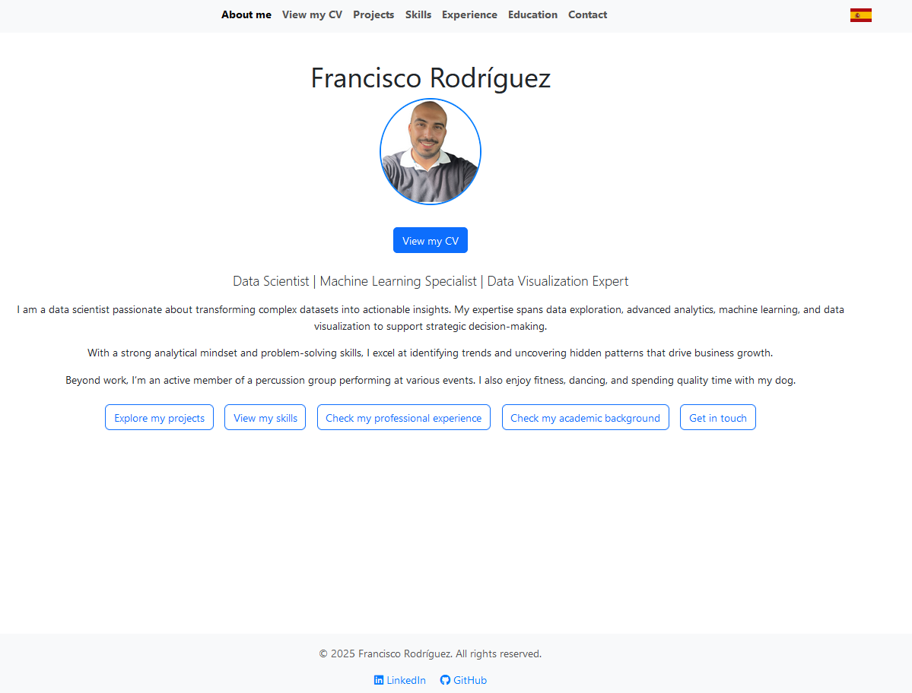

# Personal Portfolio Website

Welcome to the repository of my personal portfolio website, hosted on **GitHub Pages**. This website is designed to showcase my professional profile, projects, and CV in an organized and visually appealing manner.

## 🌐 Live Website

You can visit the website here: [**My Portfolio**](https://FranRguezCer.github.io/portfolio/)

## 🖼️ Preview



## 🚀 About the Website

The website serves as a central hub where you can:
- Learn more **about me** and my professional background.
- Explore the **projects** I’ve worked on.
- Check out my **skills** and **education**.
- Get in **contact** with me easily.
- **View my CV** in both English and Spanish.

## 🛠️ Technologies Used

- **HTML5:** For structuring the content of the website.
- **CSS3 & Bootstrap 5:** For styling, responsive design, and layout consistency.
- **JavaScript:** To add interactivity and manage dynamic content, including multilingual support (English & Spanish).
- **GitHub Pages:** For hosting the website directly from this repository.

## 📂 Project Structure

```bash
├── index.html                          # Home page (About Me)
├── projects.html                       # Projects showcase
├── skills.html                         # Technical skills
├── experience.html                     # Professional experience
├── education.html                      # Academic background
├── contact.html                        # Contact information
├── assets/
│   ├── css/
│   │   └── styles.css                  # Custom styles
│   ├── js/
│   │   └── scripts.js                  # JavaScript for interactivity and language switching
│   ├── img/                            # Images and icons
│   └── svg/                            # SVG icons
├── lang/
│   ├── index_en.json                   # English translations
│   ├── index_es.json                   # Spanish translations
│   ├── projects_en.json                # Projects section (English)
│   ├── projects_es.json                # Projects section (Spanish)
│   ├── skills_en.json                  # Skills section (English)
│   └── skills_es.json                  # Skills section (Spanish)
├── assets/cv/
│   ├── Francisco_Rodriguez_CV_en.pdf   # CV in English
│   └── Francisco_Rodriguez_CV_es.pdf   # CV in Spanish
└── README.md                           # Project documentation

```

## 🌍 Hosting

The website is hosted via **GitHub Pages**, ensuring easy access and seamless updates whenever the repository is modified.

---

Feel free to explore the code, suggest improvements, or reach out if you have any questions!

## 📄 License

This project is licensed under the [MIT License](LICENSE).